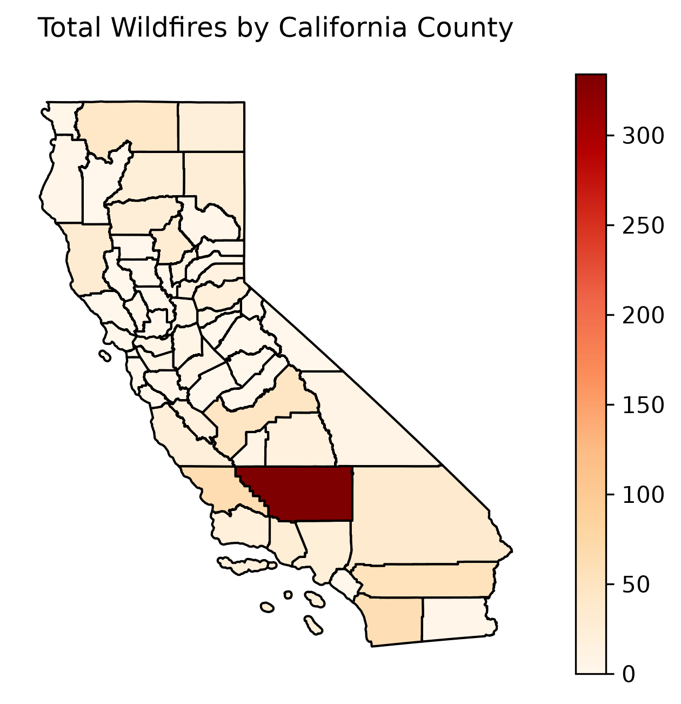

# California Wildfire Forecast Prediction

> A machine learning and statistical analysis project investigating whether historical weather and geographic information can be used to predict wildfire occurrence across California.

---

## Overview

Wildfires are influenced by a combination of environmental and geographic factors. This project combines historical wildfire records, weather observations, and California county boundaries to investigate patterns in wildfire activity and develop predictive models for wildfire occurrence.

The project uses county-level and weekly data to connect weather conditions with wildfire activity.

---

## Research Question

**Can historical weather and geographic information be used to predict wildfire occurrence across California?**

---

## Data

The project combines three primary data sources.

### Wildfire Data

The CalFire records contain approximately **18,000 wildfire records** spanning 1950–2025.

Important variables include:

- Fire name
- Alarm date
- Fire cause
- Acres burned
- Geographic location

### Weather Data

The weather dataset contains approximately **467,000 daily observations** from California weather stations.

Variables include:

- Average air temperature
- Relative humidity
- Average wind speed
- Maximum wind speed
- Precipitation

### Geographic Data

California county boundary shapefiles were used to associate wildfire locations with counties.

---

## Data Preparation

The datasets were cleaned and integrated into a county-level weekly modeling dataset.

### Weather Processing

Weather observations were:

- Converted to proper date formats
- Assigned to counties using station information
- Reduced to relevant weather variables
- Aggregated from daily observations to weekly county-level measurements

### Wildfire Processing

Wildfire records were:

- Converted to proper date formats
- Filtered to usable records
- Checked for missing dates and geometry
- Reduced to important variables
- Spatially joined to California counties

### Weekly Aggregation

Wildfire activity was aggregated by:

- County
- Week

The resulting dataset contains measures including:

- Weekly fire count
- Total acres burned
- Average temperature
- Average humidity
- Average wind speed
- Maximum wind speed
- Total precipitation

---

## Exploratory Data Analysis

I investigated wildfire activity from several perspectives.

### Wildfire Activity Over Time

Weekly wildfire counts were analyzed to understand how wildfire activity changes over time.

### Geographic Distribution

Wildfire activity was aggregated by county and visualized geographically.

The analysis showed substantial geographic variation in wildfire activity across California.

### Seasonality

Monthly wildfire activity was analyzed to identify seasonal patterns.

The analysis showed that wildfire activity varies substantially throughout the year, with higher activity during warmer and drier periods.

---

## Weather and Wildfire Relationships

I examined relationships between wildfire occurrence and several weather variables.

These included:

- Temperature
- Relative humidity
- Wind speed
- Precipitation

Correlation analysis indicated that temperature had a positive relationship with wildfire counts, while humidity and precipitation showed negative relationships.

---

## Statistical Analysis

### Correlation Analysis

Correlation analysis was used to examine relationships between weather variables and wildfire counts.

Temperature showed the strongest positive relationship with wildfire counts among the weather variables examined.

### Welch's t-test

Hot and cold weeks were compared using a Welch two-sample t-test.

The test investigated whether wildfire activity differed between weeks above and below the median temperature.

### Poisson Regression

A Poisson regression model was developed to estimate the relationship between weekly wildfire counts and weather variables.

The model included:

- Average temperature
- Average humidity
- Average wind speed
- Total precipitation

The model provided an initial statistical framework for understanding how weather conditions relate to wildfire frequency.

---

# Machine Learning

After the exploratory and statistical analysis, I developed classification models to predict wildfire occurrence.

The models evaluated were:

- Logistic Regression
- Random Forest
- XGBoost

The target variable represents whether wildfire activity occurred.

---

## Model Evaluation

Because wildfire occurrence is an imbalanced prediction problem, multiple evaluation metrics were used rather than relying only on accuracy.

The models were evaluated using:

- Precision
- Recall
- F1 Score
- ROC-AUC
- PR-AUC

### Model Comparison

| Model | Threshold | Precision | Recall | F1 | ROC-AUC | PR-AUC |
|---|---:|---:|---:|---:|---:|---:|
| Logistic Regression | 0.10 | 0.135 | **0.906** | 0.235 | **0.889** | **0.445** |
| Random Forest | 0.40 | **0.430** | 0.331 | **0.374** | 0.852 | 0.413 |
| XGBoost | 0.55 | 0.286 | 0.331 | 0.307 | 0.817 | 0.317 |

### Model Interpretation

The results demonstrate a tradeoff between identifying as many wildfire events as possible and limiting false positive predictions.

Logistic Regression achieved the highest recall and ROC-AUC among the three models, while Random Forest produced the highest precision and F1 score.

This highlights the importance of selecting an appropriate classification threshold depending on the intended use of the forecasting system.

---

## Key Findings

The analysis identified several important patterns:

- Wildfire activity varies substantially across California counties.
- Wildfire activity demonstrates strong seasonal patterns.
- Temperature is positively associated with wildfire activity.
- Humidity and precipitation show negative relationships with wildfire counts.
- Weather variables contain predictive information for wildfire occurrence.
- Different machine learning models produce different precision-recall tradeoffs.
- Model evaluation requires more than a single metric because wildfire occurrence is an imbalanced classification problem.

---

## Technologies

**Programming**

- Python

**Data Science**

- Pandas
- NumPy
- SciPy

**Geospatial Analysis**

- GeoPandas

**Visualization**

- Matplotlib
- Plotly

**Statistical Modeling**

- Statsmodels
- Poisson Regression
- Welch's t-test
- Correlation Analysis

**Machine Learning**

- Logistic Regression
- Random Forest
- XGBoost

---

## Project Status

**Completed:** Data preparation, geospatial processing, exploratory analysis, statistical analysis, machine learning modeling, and model evaluation.

The project can continue to be improved with additional model tuning, validation, forecasting analysis, and visualization.

---

## What I Learned

This project provided experience working with large, heterogeneous datasets and combining weather, wildfire, and geographic information into a unified modeling dataset.

It also provided practical experience with:

- Data cleaning
- Geospatial data
- Feature engineering
- Exploratory data analysis
- Statistical modeling
- Classification
- Imbalanced datasets
- Model evaluation
- Interpreting machine learning results
